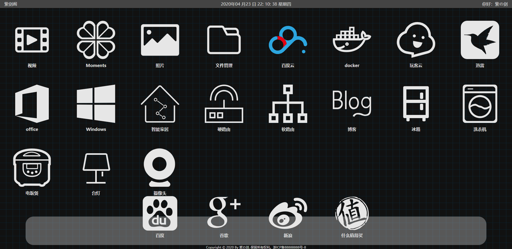
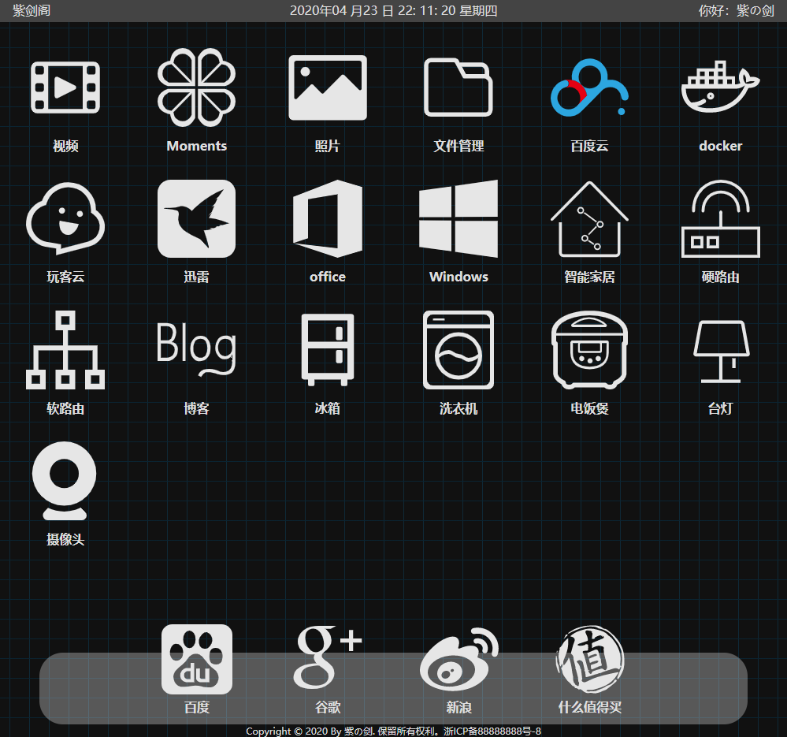
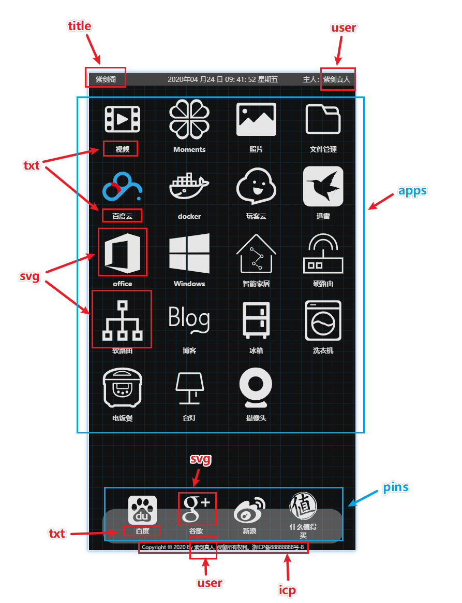

# nas-home-page
NAS自建导航页

# 说明
1. 自适应
2. 页面有打开动画，有点酷
3. 可以自动识别内网环境，使用内网地址访问
4. 部署简单,单文件
5. [demo](https://blqw.github.io/nas-home-page/)

# 效果

# 动画效果

# 配置说明

## 第一部分
* title 网页标题 (可空) 显示在标题栏 和 页面左上角
* user 你的昵称 (可空) 显示在页面右上角
* icp 备案号 (可空) 显示在页面最下面中间 (为空时隐藏整个区域)

## 第二部分
* pins 固定在网页下面的4个图标(最多4个,最少0个)
* 　┣ txt 图标名称
* 　┣ url 连接地址
* 　┣ purl 内网地址, 会自动判断是否可以访问,可以则用这个地址渲染页面
* 　┗ svg 图标代码, 下一节说怎么获取

## 第三部分
* apps 页面主体部分的图片, 不设上限, 会根据页面大小自动缩放排列
* 　┣ txt 图标名称
* 　┣ url 连接地址
* 　┣ purl 内网地址, 会自动判断是否可以访问,可以则用这个地址渲染页面
* 　┗ svg 图标代码, 下一节说怎么获取
 

 
# 获取图标
到这里 [阿里巴巴矢量图标库](https://www.iconfont.cn/)

# 其他说明
1. 如果是你的导航页使用根路径访问, 如 "http://www.xxx.com/" 那么配置文件必须为index.js
2. 按住ctrl点图标 可以在新窗口打开
3. 按住alt点图标 可以强制使用内网连接打开 (内网环境判断可能因为服务地址或网速不稳定而失败)
4. 为了追求单文件页面, 所以网页没有背景, 没有icon, 没有字体, 可以自行改造
